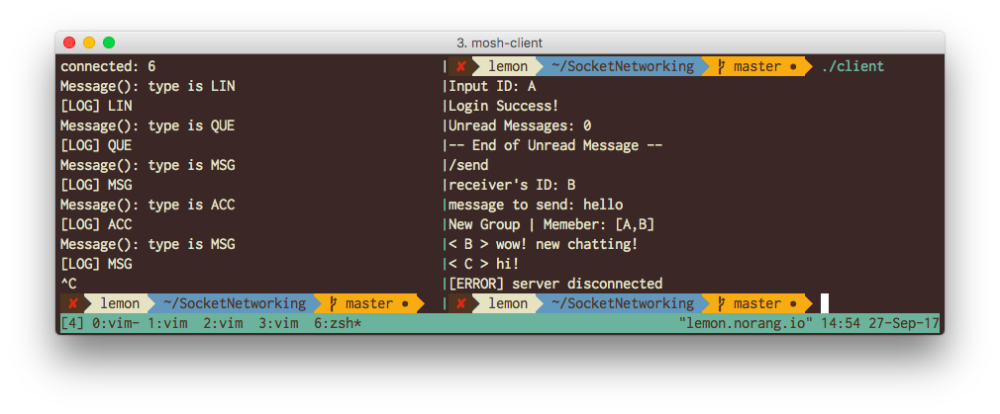

2017 Computer Network Assignment 1
---

## 1. Problem statement

다음과 같은 것을 구현해야 한다.

### Server

#### user & the list

* 유저의 가입 절차가 따로 없으므로 서버 프로그램에 유저 목록을 따로 저장해둔다.
* 유저의 구분은 ID로 한다.
* 유저의 로그인 여부를 따로 저장해둔다.
* 메시지 큐를 만들어서 로그아웃 중인 유저의 메시지를 순서대로 저장해둔다.

#### group

* 한 유저가 다른 유저에게 메시지를 보내면 그룹이 생성된다.
* 그룹에 속한 유저 목록을 정리해두어야 한다.
* 생성된 그룹에서 추가적으로 다른 유저를 초대하거나 나갈 수 있다.
* 그룹은 총 하나만 존재한다고 정의한다.
* 그룹에 속한 유저가 메시지를 보내면 모든 그룹의 유저에게 메시지를 전달한다.

#### undelivered messages & system announcements

* 로그인 중일 경우 시스템 알림과 메시지가 도착하는 대로 즉시 클라이언트에 전달한다.
* 로그아웃 중일 경우 메시지 큐에 저장해두었다가, 접속을 하면 쌓인 알림의 갯수를 전달한다.
* 유저가 쌓인 알림을 읽겠다고 하면 모든 메시지와 그 전송자를 일괄 전송해준다.
이 때 전송된 메시지는 큐에서 삭제된다.

#### multiplexing or multi-threading

* 서버에 최대 4개의 클라이언트가 소켓 통신을 시도하므로, 멀티플렉싱 혹은 멀티스레딩으로 이 소켓 통신을 관리해야 한다.

### Client

#### login & read message

* 프로그램을 시작하면 유저의 아이디를 입력하여 로그인한다.
* 로그인에 성공하면 읽지 않은 메시지의 총 갯수를 받는다.
* 읽지 않은 메시지를 받은 이후에 다른 조작을 할 수 있다.

#### logout

* 로그아웃을 할 수 있다.
* 로그아웃 중에 받은 메시지는 서버에 저장된다.

#### send message & make conversation

* 그룹 채팅이 시작되지 않은 경우, 대상을 지정하여 메시지를 보낼 수 있다.
* 메시지 송신자와 수신자가 포함된 그룹 채팅이 즉시 시작된다.

#### quit conversation/group

* 그룹 채팅이 시작되면 언제든지 그 그룹에서 나갈 수 있다.
* 그룹에서 나가더라도 자신이 과거에 했던 말이 사라지지는 않는다.
* 그룹에서 나간 이후에는 메시지를 받지 않는다.

#### invite user

* 그룹 채팅이 시작되면 언제든지 유저를 초대할 수 있다.
* 초대 권한은 모든 그룹 유저에게 있다.

#### invitation accept/decline

* 초대를 받게 되면 수락 혹은 거절을 할 수 있다.
* 초대 수락을 하게 된 이후 대화에 참여할 수 있다.
즉 초대 수신과 초대 수락 사이의 대화는 볼 수 없다.


## 2. The details of your implementation
(Protocol & other functions, User’s (Client) manual, …)

### Protocol

모든 패킷은 다음과 같은 구조로 이루어져 있다.

```
Packet_Size(int)|Packet_Type(String)|User(String)|Content(String)
```

패킷의 종류에 따라서 User, Content는 없을 수도 있다.
User는 요청의 수행 대상이 되는 이용자이다.
자세한 패킷의 구조는 아래에서 자세히 확인할 수 있다.

한편, 효율성을 위하여 Packet의 크기를 먼저 수신한 뒤 이어지는 내용을 받게 된다.
Packet의 크기는 200을 넘지 않는다.
이때 Packet_Size는 해당 값을 제외한 Packet의 전체 길이를 의미한다.

Packet_Type은 3글자로 이루어져 있다.
ID의 길이는 한 글자로만 이루어져 있다.
따라서 Content를 제외하고는 패킷의 타입과 문자의 위치를 알면 어떤 내용인지 알 수 있다.

#### User's Packet

* Log in
    * `Packet_Size|LIN|Content`
* Log Out
    * `Packet_Size|OUT`
* Read Queued Messages
    * `Packet_Size|QUE`
* Accept/Decline Invitation
    * `Packet_Size|ACC`
    * `Packet_Size|DEC`
* Left Group
    * `Packet_Size|GOU`
* Invite
    * `Packet_Size|INV|User`
* Send Message
    * `Packet_Size|MSG|Content`

#### Server's Packet

* Login Successed
    * `Packet_Size|SIN|Content`
    * 로그인을 알린다. 또한 읽어야 하는 메시지의 수가 Content에 포함된다.
* Login Failed
    * `Packet_Size|FIN`
    * 로그인 실패를 알린다.
* Invited
    * `Packet_Size|INV`
    * 초대되었음을 알린다.
* New Group
    * `Packet_Size|NEW|Content`
    * 새로 어떤 그룹에 들어가서 방의 정보를 받음. Content에 `User1, User2`와 같이 유저의 목록이 포함됨.
* Left/Join Group
    * `Packet_Size|GOU|User`
    * `Packet_Size|GIN|User`
* New Message
    * `Packet_Size|MSG|User|Content`
    * User가 Content의 내용을 송신함
* Conversation Created
    * `Packet_Size|CRE|User|Content`
    * 다른 사람이 날 초대하여, 메시지를 받게 됨.
* Error
    * `Packet_Size|ERR|Content`

### Common Implementation

read_int, read_string으로 추상화하여 read를 직접 다루지 않았다.
마찬가지로 송신시에도 send_packet()으로 recv를 직접 다루지 않았다.

C++11의 thread를 사용하여 구현하였다.

#### Error Handling

* 쌓인 메시지 있는 경우 다른 작업 수행 불가
* 쌓인 메시지 읽고 난 후 다시 읽기 요청 불가
* 중복 로그인 불가
* 강제 종료시에도 로그아웃 처리됨
* 그룹에 이미 속한 사람 초대 불가
* 그룹에 속하지 않은 경우
    * 메시지 송신 불가
    * 초대 불가
    * 그룹 떠나기 불가
* 초대를 받지 않은 경우
    * 초대 거절, 승인 불가
* 그룹이 생성된 경우
    * 다른 사람에게 메시지 보내기 불가
* 메시지가 200자를 초과하는 경우 보낼 수 없음


### Server Implementation

#### Abstraction

Group, User, Message의 클래스를 구성하여 스트링을 직접 다루는 것을 최소화하였다.

###


### How to run program

#### Compilation & Execution

1. `make`하여 프로그램을 컴파일한다.
    - 서버 및 클라이언트를 따로 컴파일 하기 위해서는 `make server`, `make client`를 하면 된다.
1. `./server`하여 서버를 실행한다.
1. `./client`하여 클라이언트를 실행한다.

#### How to use Client

1. 로그인 화면이 나타나면 아이디를 입력한다.
아이디는 `A`에서 `D`까지 네 개의 계정이 미리 만들어져 있다.
1. 로그인에 성공하면 로그인 성공 메시지와 부재중 메시지의 수를 확인할 수 있다.
1. 부재중 메시지가 있는 경우, `/read` 하여 부재중 메시지를 읽으면 다른 작업을 수행할 수 있다.
부재중 메시지를 확인하지 않고 다른 작업을 수행하면 경고 메시지가 나타난다.
부재줄 메시지가 0인 경우, 곧바로 다른 작업을 할 수 있다.
1. 할 수 있는 작업은 다음과 같다.
    - `/send`입력 후 순차적으로 [USER] [MSG] 입력
    - `/invite` 입력 후 [USER] 입력
    - `/decline`, `/accept`
    - `/left group`
    - `/logout`
    - 메시지 보내기

## 3. Results



## 4. Discussion

### 셀렉트 쓰기
유저가 늘어나는 경우 셀렉트로 효율을 늘릴 수 있다.

### 가상함수
가상함수를 사용하여 메시지를 구조화하고, 코드를 간결하게 바꿀 수 있다.
